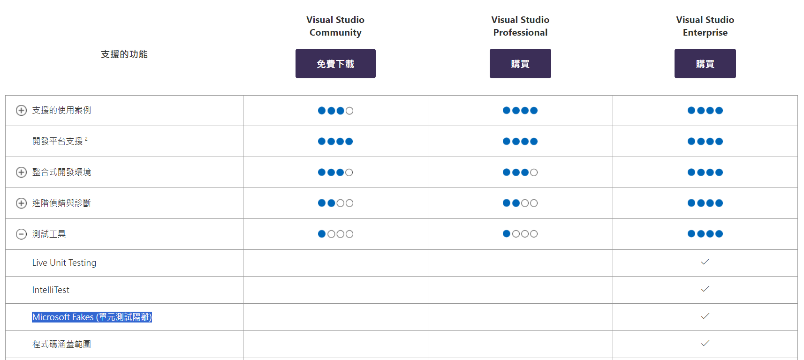
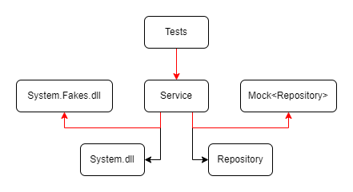
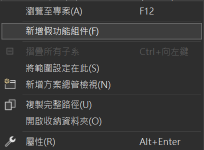
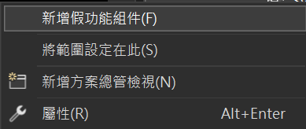
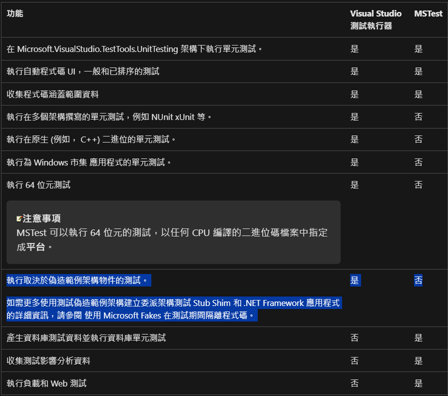

### 需要 **Visual Studio Enterprise**


## 介紹
程式碼隔離（isolating code）是一種**測試策略**，透過使用假物件（例如 Microsoft Fakes），將受測程式碼與應用程式的其餘部分隔離開來。這樣可以**專注於測試特定功能**，並在測試失敗時迅速找到問題根源。此方法允許測試在其他應用程式部分尚未就緒時進行，**提高了測試的獨立性**。

> 填充碼的運作方式是將「繞道 (detours)」插入至測試應用程式的程式碼基底中。 每當出現針對原始方法的呼叫時，Fakes 系統就會介入並重新導向該呼叫，從而執行您的自訂填充碼，而不是原始方法。 --- Microsoft Docs



## 下載 NuGet Package
- [Microsoft.QualityTools.Testing.Fakes](https://www.nuget.org/packages/Microsoft.QualityTools.Testing.Fakes/16.11.230815?_src=template)


## 使用時機
- Static 方法
- .NET Framework 本身的物件
- 外部套件
- 其他相依物件

## 使用說明
### 產生 `.fakes` 檔案
- 針對專案內 Static 方法
```
<測試專案名稱>
    |_ 相依性
        |_ 專案
            |_ <受測專案名稱>
```
- 針對 .NET Framework 本身的物件
```
<測試專案名稱>
    |_ 相依性
        |_ 架構
            |_ Microsoft.NETCore.App
                |_ <要隔離物件的組件>
```
對著受測專案或要隔離的組件點右鍵
- 受測專案



- 要隔離的組件



接著點「新增假功能組件」，然後會自動幫你生成一個 Fakes 的資料夾裡面包含受測專案的 `.fakes` 檔案
```
<測試專案名稱>
    |_ Fakes
        |_ <受測專案或組件名稱>.fakes
```

最後記得在專案檔（`.csproj`）裡面加上參考，要加上的 `.dll` 檔可在 FakesAssemblies 資料夾中找到其檔案名稱
```xml
<ItemGroup>
    <Reference Include="FakesAssemblies\<假功能組件名稱>.dll"/>
</ItemGroup>
```
```
<測試專案名稱>
    |_ FakesAssemblies
        |_ <假功能組件名稱>.dll
```

## 範例程式
### ExampleHelper.cs
```c#
public class ExampleHelper
{
    public static string GetExampleName()
    {
        return "StaticExample";
    }
}
```
這裡建立一個 Static 方法來做模擬測試

### FakeService.cs
```c#
public ExampleModel GetExampleModel()
{
    ExampleModel exampleModel = new ExampleModel()
    {
        Id = Guid.NewGuid(),
        Name = ExampleHelper.GetExampleName(), // Static 方法
        Description = DateTime.Now.ToString()  // System.Runtime.dll
    };

    return exampleModel;
}
```
在這個要被測試的方法中使用了 Static 方法與 .NET Framework 本身的物件

### FakeServiceTests.cs
```c#
[Fact]
public void GetExampleModel_ReturnExampleModel()
{
    using (ShimsContext.Create())
    {
        // Arrange
        IFakeService fakeService = CreateDefaultFakeService();

        UnitTest.Example.Project.Helper.Fakes.ShimExampleHelper.GetExampleName = () =>
        {
            return "Example";
        };

        System.Fakes.ShimDateTime.NowGet = () =>
        {
            return new DateTime(1000, 1, 1);
        };

        // Act
        ExampleModel result = fakeService.GetExampleModel();

        // Assert
        Assert.NotNull(result);
        Assert.NotNull(result.Name);
        Assert.NotNull(result.Description);
        Assert.Equal("Example", result.Name);
        Assert.Equal("1000/1/1 上午 12:00:00", result.Description);
    }
}
```
最後撰寫單元測試時，記得使用 `ShimsContext.Create()` 並配合 `using` 來建立 Fakes 的方法，系統處置 `ShimsContext` 時，也會移除該期間內建立的所有使用中 Fakes 方法

## 使用結果


這樣就成功了，如此一來，便可以使外部相依的組件或自訂的 Static 方法也達到隔離的效果，增加測試的可靠度

## 執行測試
若是直接在 Visual Studio Enterprise 使用測試總管（Test Explorer）執行測試基本上沒什麼問題，但是若使用 CLI 執行測試則考慮以下情況

- `dotnet test`
> Microsoft.QualityTools.Testing.Fakes.UnitTestIsolation.UnitTestIsolationException : 無法解析來自 COR_PROFILER_PATH 和 COR_PROFILER 環境變數的分析工具路徑。

- `dotnet vstest <測試專案名稱>.dll`
> Microsoft.QualityTools.Testing.Fakes.UnitTestIsolation.UnitTestIsolationException : 無法解析來自 COR_PROFILER_PATH 和 COR_PROFILER 環境變數的分析工具路徑。

- `vstest.console.exe <測試專案名稱>.dll`
> Success

### Note 
這裡我嘗試使用 Visual Studio Community 資料夾底下的 `vstest.console.exe` ，但會得到跟其他測試執行器一樣的結果，但用 Visual Studio Enterprise 資料夾底下的 `vstest.console.exe` 卻可以正常執行

以下 Visual Studio 測試執行器指的就是 `vstest.console.exe` 



## 重構解法
所以建議使用控制翻轉（Inversion of Control，IoC）的方式來重構程式碼

### TimeProvider.cs
```c#
public class TimeProvider : ITimeProvider
{
    public TimeProvider() {}

    public DateTime GetDateTimeNow()
    {
        return DateTime.Now;
    }
}
```
建立一個 Provider 將要使用到的 Static 方法或 .NET Framework 本身的物件放在這個類別的方法中

### FakeService.cs
```c#
private readonly ITimeProvider _timeProvider; 

public FakeService(ITimeProvider timeProvider) 
{ 
    _timeProvider = timeProvider;
}

public ExampleModel GetExampleModel()
{
    ExampleModel exampleModel = new ExampleModel()
    {
        Id = Guid.NewGuid(),
        Name = "Name",
        Description = _timeProvider.GetDateTimeNow().ToString()
    };

    return exampleModel;
}
```
接著用 DI 的方式來使用 Provider，取代之前直接用 Static 方法或 .NET Framework 本身的物件


### FakeServiceTests.cs
```c#
private Mock<ITimeProvider>? _mockTimeProvider;
private FakeService CreateDefaultFakeService()
{
    _mockTimeProvider = new Mock<ITimeProvider>();

    return new FakeService(_mockTimeProvider.Object);
}

[Fact]
public void GetExampleModel_ReturnExampleModel()
{
    using (ShimsContext.Create())
    {
        // Arrange
        IFakeService fakeService = CreateDefaultFakeService();

        _mockTimeProvider?.Setup(provider => provider.GetDateTimeNow()).Returns(new DateTime(1000, 1, 1));

        // Act
        ExampleModel result = fakeService.GetExampleModel();

        // Assert
        Assert.NotNull(result);
        Assert.NotNull(result.Name);
        Assert.NotNull(result.Description);
        Assert.Equal("Example", result.Name);
        Assert.Equal("1000/1/1 上午 12:00:00", result.Description);
    }
}
```
最後，可以使用 Moq 這個套件將我們要模擬的物件給取代並回傳預期的結果

### Note
在 .NET 8 已經有定義了一個時間的抽象類別 TimeProvider 可以讓我們用上述的方式來使用，不必再自己撰寫一個 TimeProvider 類別，這樣可以使單元測試更加的順利

## Reference
- [[Day 7]Unit Test - Stub, Mock, Fake簡介](https://ithelp.ithome.com.tw/articles/10103969)
- [使用 Microsoft Fakes 隔離測試中的程式碼](https://learn.microsoft.com/zh-tw/visualstudio/test/isolating-code-under-test-with-microsoft-fakes?view=vs-2022)
- [Microsoft Fakesを利用したテストコードの記述](https://qiita.com/mima_ita/items/9ebb0f40d3209f33a45d)
- [在建置流程中執行測試](https://learn.microsoft.com/zh-tw/previous-versions/visualstudio/visual-studio-2012/ms253138(v=vs.110)?redirectedfrom=MSDN#Runner)
- [使用填充碼隔離應用程式以進行單元測試](https://learn.microsoft.com/zh-tw/visualstudio/test/using-shims-to-isolate-your-application-from-other-assemblies-for-unit-testing?view=vs-2022&source=recommendations&tabs=csharp)
- [Microsoft Fakes 中的程式碼產生、編譯和命名慣例](https://learn.microsoft.com/zh-tw/visualstudio/test/code-generation-compilation-and-naming-conventions-in-microsoft-fakes?view=vs-2022)
- [Want to run "Unit Test with Fakes" on build server without installing Visual studio](https://social.msdn.microsoft.com/Forums/en-US/ac8bd6fa-644d-4a54-8bd9-d437c80a0caf/want-to-run-quotunit-test-with-fakesquot-on-build-server-without-installing-visual-studio?forum=vsunittest)
- [Microsoft.Fakes won't run in normal unit test contexts](https://stackoverflow.com/questions/19385037/microsoft-fakes-wont-run-in-normal-unit-test-contexts)
- [TimeProvider 類別](https://learn.microsoft.com/zh-tw/dotnet/api/system.timeprovider?view=net-8.0)
- [TimeProvider and ITimer: Writing Unit Tests with Time in .NET 8 Preview 4](https://www.infoq.com/articles/dotnet-unit-tests-time-timezone/)
