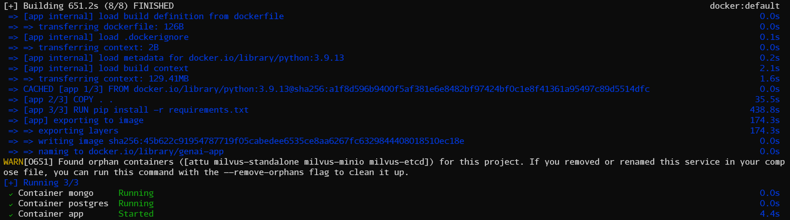
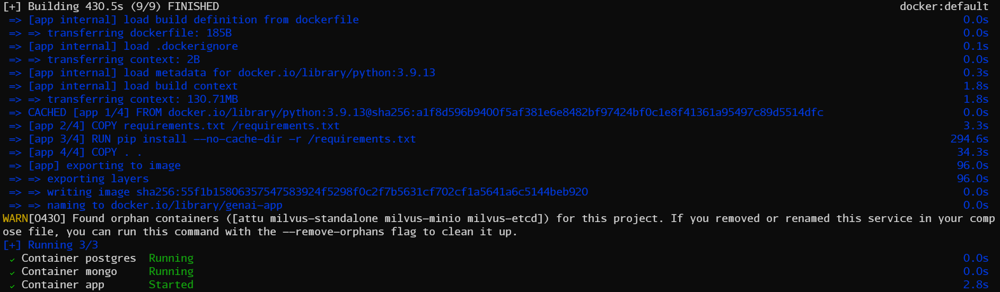
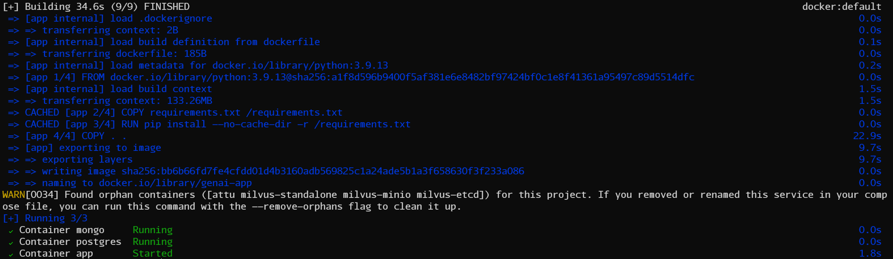

## 概述
在使用 Docker Compose 進行部署時，每次都因為 Python 需要下載  `requirements.txt` 中的套件，導致建置時間相當冗長

### Dockerfile

```
FROM python:3.9.13
COPY . .
RUN pip install -r requirements.txt
CMD ["python", "main.py"]
```

上面這是一開始使用的 Dockerfile，下面會說明如何修改它來達到加速的效果



上面這張圖可以看到每次都將近要跑到約 10 分鐘，其中下載 `requirements.txt`  中的套件時就跑了約 7 分鐘

## 解決
### Dockerfile

```
FROM python:3.9.13
COPY requirements.txt /requirements.txt
RUN pip install --no-cache-dir -r /requirements.txt
COPY . .
CMD ["python", "main.py"]
```

上面可以看到這邊會把 `requirements.txt` 在複製整個目錄之前先複製過去並下載當中的套件，這是因為 `COPY` 這個指令複製的檔案如果有變動的話，他就會使得後面的 Layer Cache 失效，所以這樣子撰寫便可以使用到 Layer Cache 來加快建置速度



當修改完重建置時會發現加快了一點，但其實這不是因為 Layer Cache 的關係，而是因為在下載套件的指令中加入了 `--no-cache-dir` 這個參數，他會避免 pip 去檢查套件 Cache 的版本，所以會加快下載套件的速度



當再重建置一次時會發現到這次就使用到上次建置的 Layer Cache 來大幅降低建置時間了

## Reference
- [打造最小 Python Docker 容器](https://blog.wu-boy.com/2021/07/building-minimal-docker-containers-for-python-applications/)
- [镜像打包这么慢，你该反省一下你的dockerfile姿势了](https://www.cnblogs.com/JulianHuang/p/12953129.html)
- [Python pip的--no-cache-dir有什么用](https://geek-docs.com/python/python-ask-answer/245_python_what_is_pips_nocachedir_good_for.html)