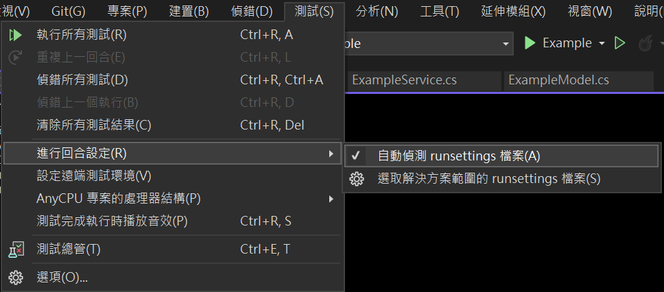
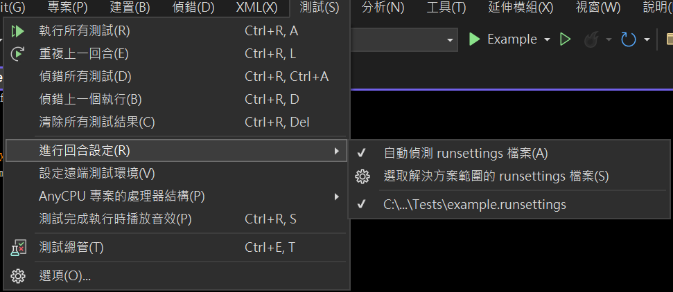
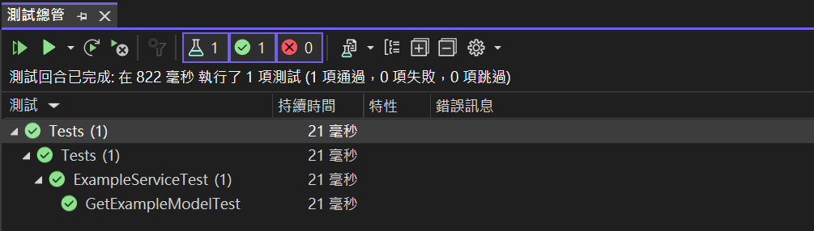

在這裡做一個簡單的範例來示範

## 準備測試

這裡先定義了一個簡單的 model

#### ExampleModel.cs

```c#
namespace Example.Models
{
    public class ExampleModel
    {
        public Guid Id { get; set; }

        public string? Name { get; set; }

        public string? Description { get; set; }
    }
}
```

接著開始撰寫要被測試的 function，讓他讀取環境變數

#### ExampleService.cs

```c#
public ExampleModel GetExampleModel()
{
    ExampleModel exampleModel = new ExampleModel()
    {
        Id = Guid.NewGuid(),
        Name = Environment.GetEnvironmentVariable("EXAMPLE_NAME"),
        Description = Environment.GetEnvironmentVariable("EXAMPLE_DESCRIPTION")
    };

    return exampleModel;
}
```

這裡我是使用 xUnit 這個框架來寫測試，驗證是否真的存取到已設定的環境變數

#### ExampleServiceTest.cs

```c#
[Fact]
public void GetExampleModelTest()
{
    ExampleModel exampleModel = _exampleService.GetExampleModel();

    Assert.NotNull(exampleModel);
    Assert.NotNull(exampleModel.Name);
    Assert.NotNull(exampleModel.Description);
    Assert.Equal("Example", exampleModel.Name);
    Assert.Equal("I am an example", exampleModel.Description);
}
```

## 設定專案的 runsettings

現在在你的測試專案中加入 runsetting，其中檔案名稱並不重要，只要使用的副檔名為 `.runsettings` 即可，即 `<FileName>.runsettings`

#### example.runsettings

```xml
<?xml version="1.0" encoding="utf-8"?>
<RunSettings>
  <RunConfiguration>
    <EnvironmentVariables>
	<EXAMPLE_NAME>Example</EXAMPLE_NAME>
        <EXAMPLE_DESCRIPTION>I am an example</EXAMPLE_DESCRIPTION>
    </EnvironmentVariables>
  </RunConfiguration>
</RunSettings>
```

接下來，在`.csproj`檔案中設定

```xml
<PropertyGroup>
  <RunSettingsFilePath>$(MSBuildProjectDirectory)\example.runsettings</RunSettingsFilePath>
</PropertyGroup>
```

或是這裡 Visual Studio 2022 也可以透過兩種方式設定測試專案使用的 runsettings

- 自動偵測
- 手動選取 (這裡我是使用這種方式避免因為他沒有偵測到造成問題)



設定好之後應該會出現像以下的畫面，顯示他連結到的 runsettings



## 執行結果

然後開始測試，成功完成!



## Reference

- [Configure unit tests by using a .runsettings file](https://learn.microsoft.com/en-us/visualstudio/test/configure-unit-tests-by-using-a-dot-runsettings-file?view=vs-2022)
