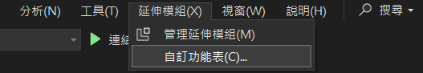
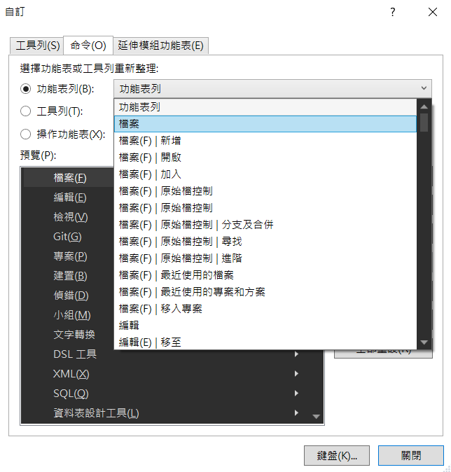
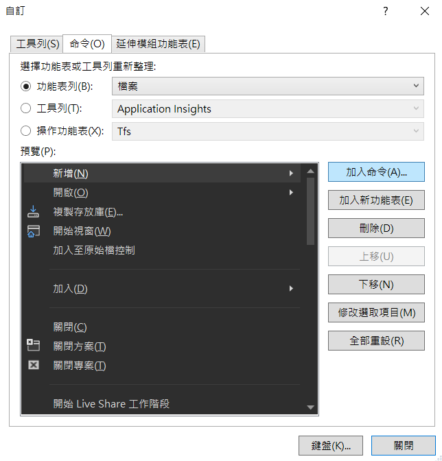
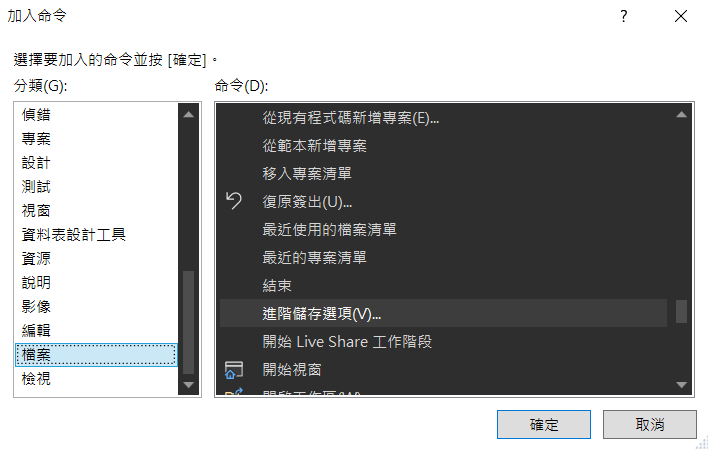
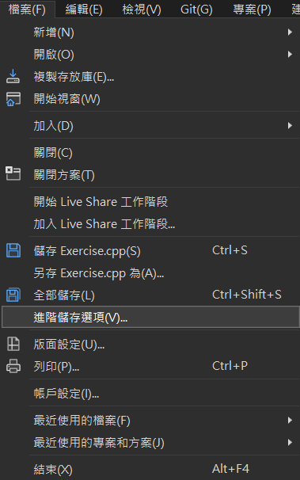
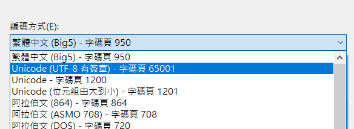

這篇主要紀錄一下我踩到的編碼格式坑

## 概述
在撰寫 Unit Test 時因為有驗證 Log 訊息的需求，所以使用了 [ILogger.Moq](https://www.nuget.org/packages/ILogger.Moq) 套件來驗證，但是當我在 Local 環境執行測試時皆正常通過，但是當部署在 Azure DevOps 的 Dev 環境時卻出現以下錯誤：
```
Error Message:
   Moq.VerifyLogException : 
Expected invocation on the mock at least once, but was never performed: logger => logger.LogInformation("�Ƶ{�^���d�L��taskQueneItem.", new[] {  })


---- Moq.MockException : 
Expected invocation on the mock at least once, but was never performed: logger => logger.Log<It.IsAnyType>(LogLevel.Information, It.IsAny<EventId>(), It.Is<It.IsAnyType>((v, t) => VerifyLogExtensions.CompareMessages("�Ƶ{�^���d�L��taskQueneItem.", VerifyLogExpression, v)), It.IsAny<Exception>(), (Func<It.IsAnyType, Exception, string>)It.IsAny<object>())
```

## 解決
看到亂碼當即想到應該是編碼格式的問題導致測試失敗，因此我立即查看我儲存的檔案格式為 Big-5 非 UTF-8，所幸按照以下步驟後得以解決

### 步驟
因為 Visual Studio 2022 預設沒有啟用 `進階儲存選項` 因此需要手動配置

1. 點選 `延伸模組` 接著點 `自動功能表`



1. 開啟後可以找想要配置的位置，我是存放在 `檔案` 的功能列中



3. 在想要新增的位置點選 `加入命令`



4. 點選左側 `檔案` 後在右側找到 `進階儲存選項`



5. 在要儲存時點選 `進階儲存選項`



6. 最後點選想要儲存的編碼格式就完成了



經過編碼格式的轉換最後也成功通過 Dev 環境 CI 的 Unit Test 了

## Reference
- [How to config visual studio to use UTF-8 as the default encoding for all projects?](https://stackoverflow.com/questions/41335199/how-to-config-visual-studio-to-use-utf-8-as-the-default-encoding-for-all-project)
- [Visual Studio 设置默认编码格式为 UTF-8 或 GB2312-80 与文件没有高级保存选项怎么显示](https://blog.csdn.net/qq_41868108/article/details/105750175)