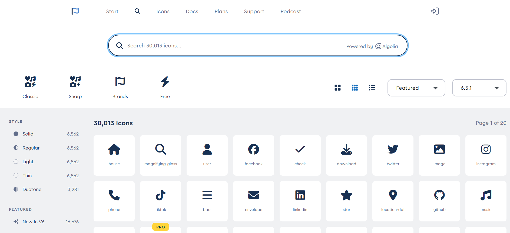
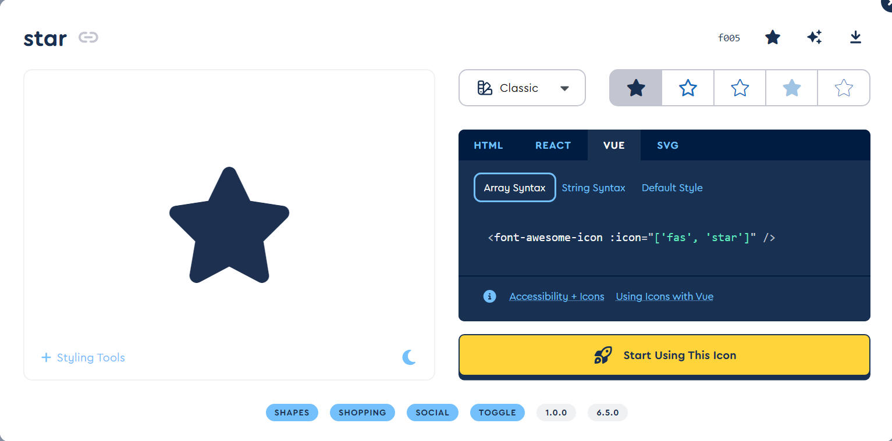

Font Awesome 提供了許多可使用的 icon，可以讓我們快速的使用他們來美化自己的網站

## Icon 種類說明
由於是使用免費的所以能選擇的只有三種分別是

- Soild
- Regular
- Brands

而至於真正能使用甚麼可以在 [Font Awesome Icons](https://fontawesome.com/search) 看到，其中左側的標籤能夠選擇的就是 `Solid` 跟 `Regular` 這兩個，而上面的標籤也能選到 `Brands`，因此可以在這個也頁面先選擇好要使用的 icon 種類再進行下載或是配置



## 下載
fontawesome 的 SVG 核心套件

```
yarn add @fortawesome/fontawesome-svg-core
```

這裡是免費的所以只能挑選三種所需要的 icon 種類進行下載，也可以升級 [Pro](https://fontawesome.com/plans) 使用更多 icon

```
yarn add @fortawesome/free-solid-svg-icons
yarn add @fortawesome/free-regular-svg-icons
yarn add @fortawesome/free-brands-svg-icons
```

下載 Vue Component 套件

```
yarn add @fortawesome/vue-fontawesome@latest-3
```

## 配置
這裡我是以 vite 專案為例

```
<專案名稱>
|_ src
    |_ main.js
```

在 main.js 中進行以下的配置

```javascript
import { createApp } from 'vue'

import { library } from '@fortawesome/fontawesome-svg-core'
import { fas } from '@fortawesome/free-solid-svg-icons'
import { far } from '@fortawesome/free-regular-svg-icons'
import { fab } from '@fortawesome/free-brands-svg-icons'
import { FontAwesomeIcon } from '@fortawesome/vue-fontawesome'

import './style.css'
import App from './App.vue'

library.add(fas, far, fab)

createApp(App)
.component('font-awesome-icon', FontAwesomeIcon)
.mount('#app')
```

這裡先引入安裝的套件，然後在 library 中添加要使用到的 icon。如果沒有指定特定 icon，可使用 `fas`、`far` 和 `fab` 代表引入該 icon 種類的所有 icon

如果要引入單一個 icon 也可以按照以下的方式，這裡用 star 這個 icon 舉例

```javascript
import { faStar } from '@fortawesome/free-solid-svg-icons'

library.add(faStar)
```

## 使用
接著在 `.vue` 檔案中就可以用以下任一種方式使用

```xml
<!-- Array syntax -->
<font-awesome-icon :icon="['fas', 'star']" />
<!-- String syntax -->
<font-awesome-icon icon="fa-solid fa-star" />
<!-- Default style -->
<font-awesome-icon icon="star" />
```

這些可以在 icon 的右側直接複製來使用



最後就可以在畫面上出現想要的 Icon 了 !

## Referenece:
- [Set Up with Vue](https://fontawesome.com/docs/web/use-with/vue/)
- [How To Use Vue.js With Font Awesome](https://blog.fontawesome.com/how-to-use-vue-js-with-font-awesome/)
- [如何在 Vue 裡面使用 Font Awesome](https://medium.com/%E6%BC%AB%E7%AF%89%E8%98%AD%E6%A0%BC/%E5%A6%82%E4%BD%95%E5%9C%A8-vue-%E8%A3%A1%E9%9D%A2%E4%BD%BF%E7%94%A8-font-awesome-c0d8f66c1e3b)
- [Vue3 使用 fontawsome 免費 icon font](https://penueling.com/%E7%B7%9A%E4%B8%8A%E5%AD%B8%E7%BF%92/vue3-%E4%BD%BF%E7%94%A8-fontawsome-%E5%85%8D%E8%B2%BB-icon-font/)