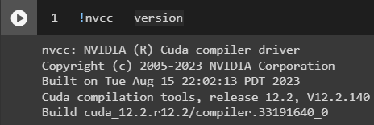
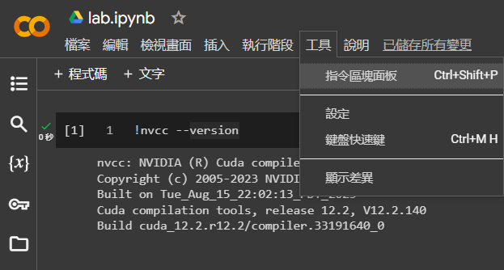
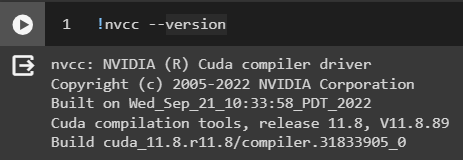

## 概述
在我使用 Colab 並且安裝 onnxruntime 套件後想要執行我寫好的 Python 程式碼後發現 onnxruntime 報出以下錯誤

```
[E:onnxruntime:Default, provider_bridge_ort.cc:1480 TryGetProviderInfo_CUDA]
/onnxruntime_src/onnxruntime/core/session/provider_bridge_ort.cc:1193 onnxruntime::Provider& onnxruntime::ProviderLibrary::Get() 
[ONNXRuntimeError] : 1 : FAIL : Failed to load library libonnxruntime_providers_cuda.so with error: libcufft.so.10: cannot open shared object file: No such file or directory
```

發現是 onnxruntime 不支援現有的 CUDA 版本後，我用以下指令查看當前 CUDA 版本

```
!nvcc --version
```

原來 Colab 升級了 CUDA 版本但是 onnxruntime 還沒支援，於是我就想將 Colab 上的 CUDA 暫時降版本以解決這個問題，也有其他解決方式是再安裝較低版本的 CUDA 來解決，但是下面這個解決方式，我認為更加的快速也不必再安裝任何東西

## 解決
1. 先查看當前 CUDA 版本為 12.2



2. 接著點選在 `工具` 下的 `指令區塊面板`



3. 搜尋關鍵字 `版本` 後找到 `使用備用執行階段版本`


4. 點選 `使用備用執行階段版本`


5. 最後再查看一次版本可以發現 CUDA 版本被降為 11.8 了



但這個方式就無法指定想要的 CUDA 版本只能使用 Colab 提供的舊版本

## Reference
- [Upgrade to CUDA 12.2, tensorflow 2.15.0, keras 2.15.0, and Nvidia driver 535.104.05](https://github.com/googlecolab/colabtools/issues/4214)