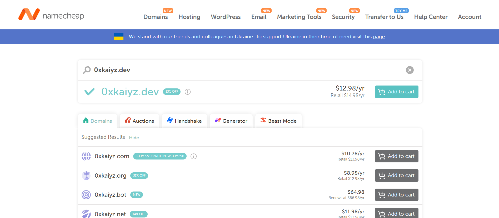
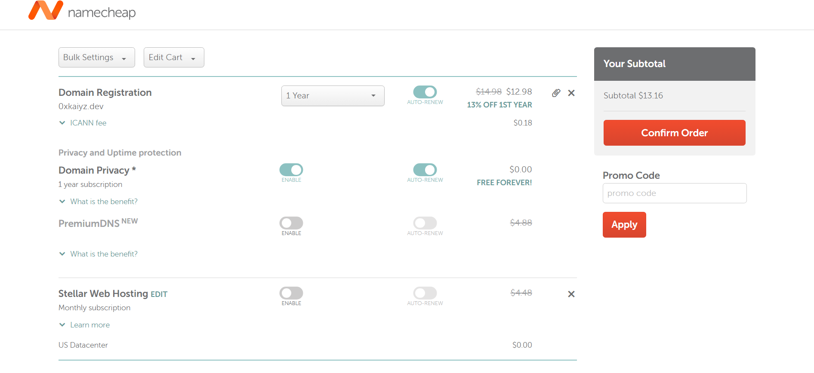
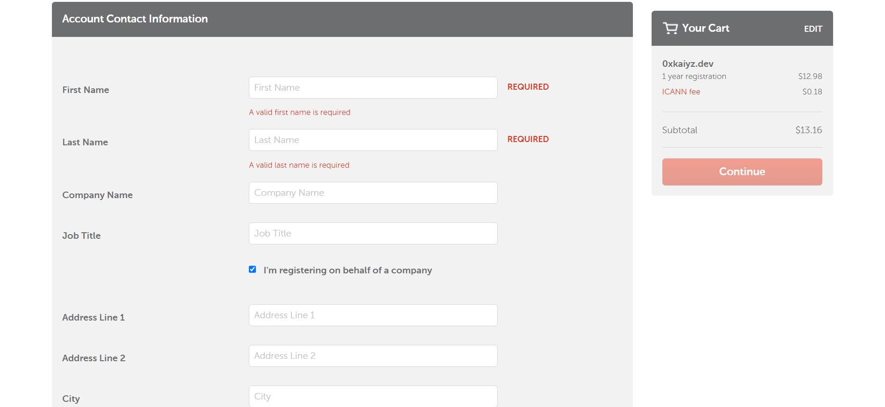
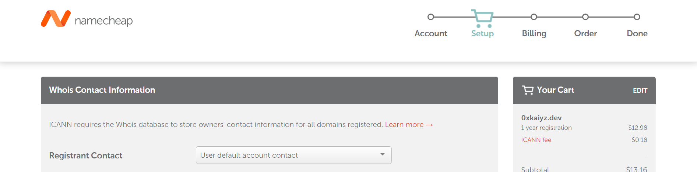
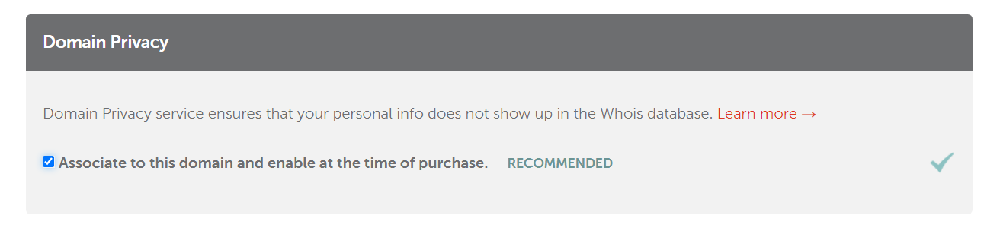
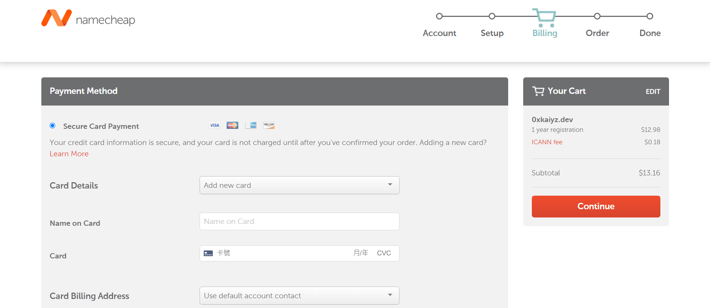
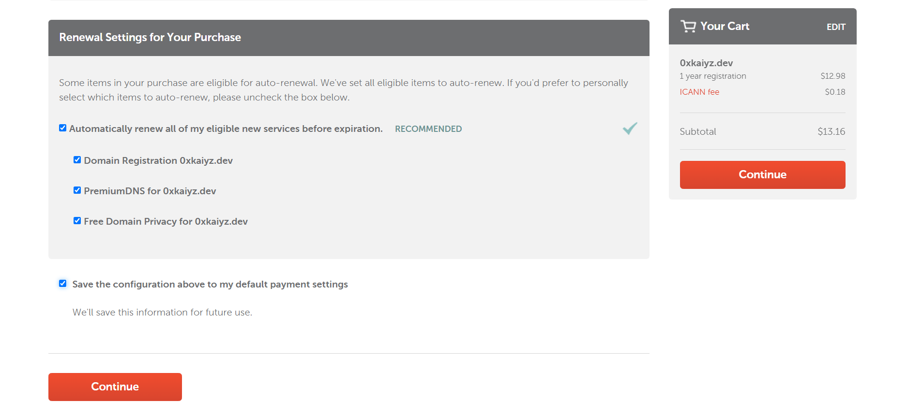
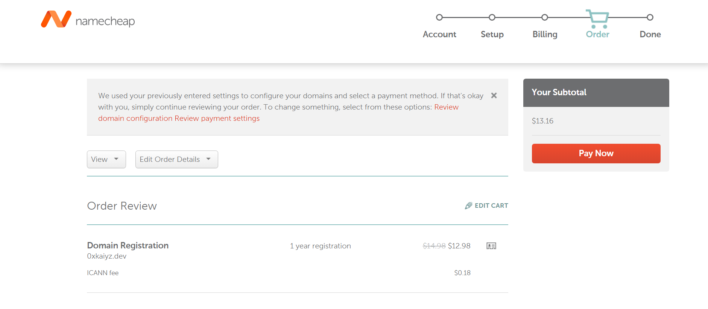
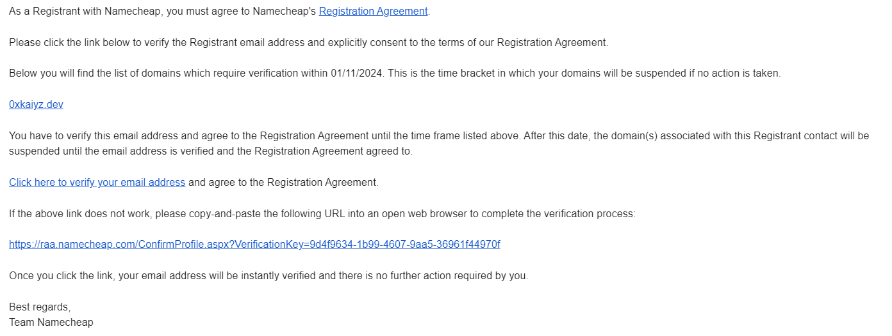

## 概述
有一個好記的網域對於一個網站蠻重要的事，所以在經過多個不同網域商的價格比較後，最後決定透過 [Namecheap](https://www.namecheap.com/) 購買網域

## 步驟
一開始就搜尋你想要的網域名稱，然後找到想要的域名就可以按下 `Add to cart` 將它加入購物車中

這裡可以根據需求選擇其他需要服務，之後按下 `Confirm Order` 確認訂單

接著就會要求你輸入一些基本的資訊，待輸入完成之後點選 `Continue`

這個頁面主要是要確認一下將用於 Whois 的聯絡資訊

確認的這個頁面下方有一個 `Domain Privacy` 的選項，這裡建議選取這樣別人就無法輕易從 Whois 資料庫取得聯絡資訊

點選完 `Continue` 後就會進入下方的付款頁面了

填完付款資訊後，下方這裡我是設置讓他可以自動續訂，設置完一樣點 `Continue`

最後一頁這邊會讓你確認這次訂單的所有資訊，然後點 `Pay Now` 就完成購買了

最後記得去驗證一下 Email 地址後就得到一個屬於你的 Domain Name 了

