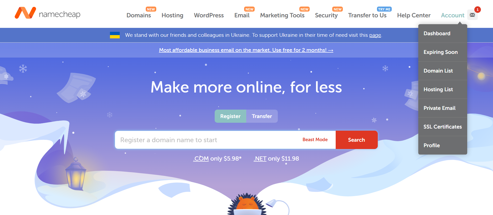
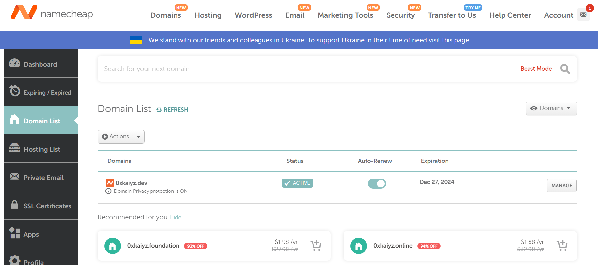
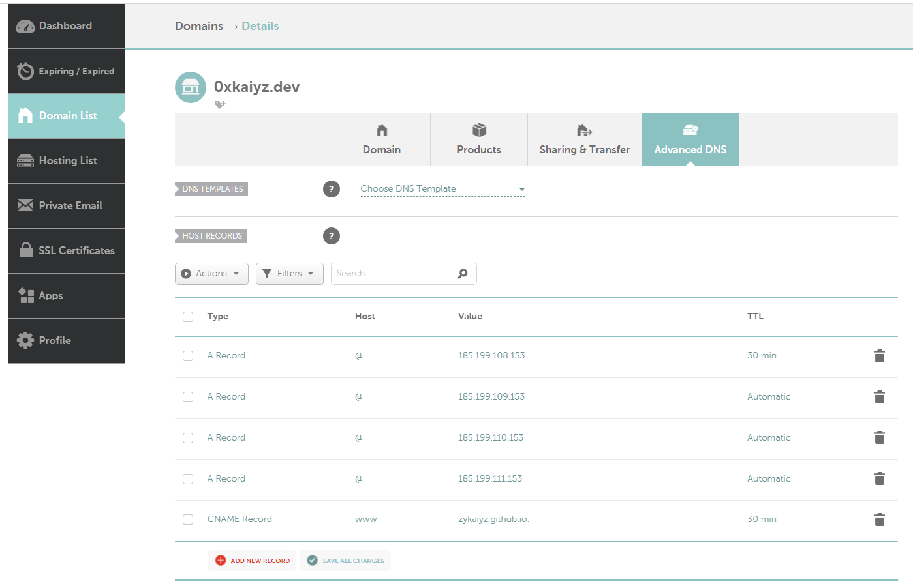
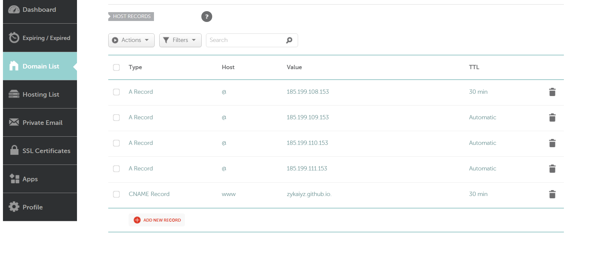
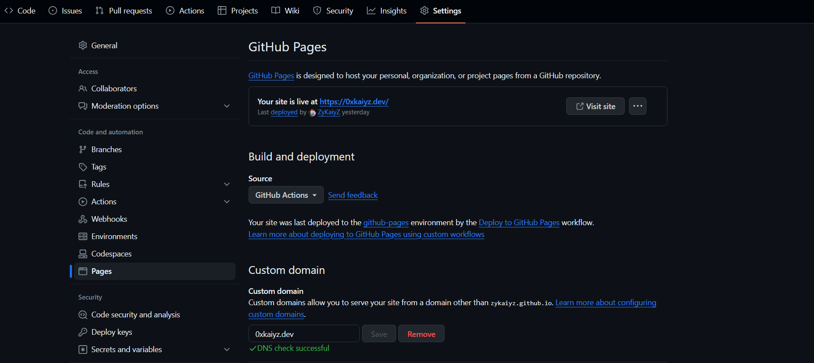

## 概述
在 Namecheap 買完 domain name 後就可以來設定網站了，這邊我是用 GitHub Page 來 host 的，下面會來介紹一下這個過程

## 步驟
首先，先到 Namecheap 登入後，點選 `Account` 下的 `Domain List`

進來後，點選想要設定的 domain name 右側的 `MANAGE`

然後，這裡再點 `Advanced DNS` 就會到以下這個頁面

接著，點 `ADD NEW RECORD` 來新增以下的設定來指向 GitHub 的 DNS server，`username` 記得設定成自己的使用者名稱

| Type         | Host | Vale                 | TTL       |
| ------------ | ---- | -------------------- | --------- |
| A Record     | @    | 185.199.108.153      | 30min     |
| A Record     | @    | 185.199.109.153      | Automatic |
| A Record     | @    | 185.199.110.153      | Automatic |
| A Record     | @    | 185.199.111.153      | Automatic |
| CNAME Record | www  | username.github.io | 30min     |

設定完就是以下這樣的畫面    
    

最後到你 Repository 後，點 `Setting` 之後點選左側的 `Pages`，接著在 `Custom domain` 欄位輸入自己的 domain name，然後 GitHub 會開始驗證，待完成後下面就會顯示成功  
    

如此一來不論是輸入 `<username>.github.io` 還是自己的 domain name 就都可以連到你的網站了
    
## Reference
- [GitHub Page 綁定 Namecheap 域名](https://riemann.blog/posts/859f993a/)
- [Managing a custom domain for your GitHub Pages site](https://docs.github.com/en/pages/configuring-a-custom-domain-for-your-github-pages-site/managing-a-custom-domain-for-your-github-pages-site)